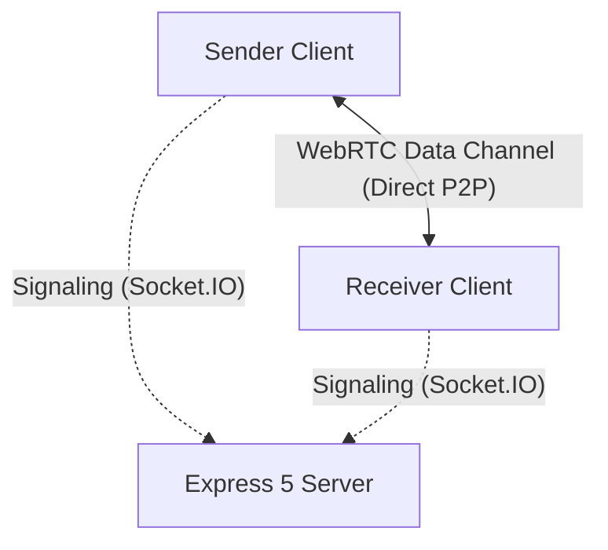

# SD-Share: Real-Time Peer-to-Peer File Sharing Platform

SD-Share is a premium, real-time peer-to-peer file sharing platform designed for transferring files of virtually any size directly between two users. It acts purely as a signaling conduit—files are never permanently stored on any server or database. Data travels directly from Sender to Receiver utilizing chunked WebRTC transfers.

## 🚀 Features

- **True P2P Transfer**: Files go directly between clients via WebRTC Data Channels.
- **Resumable Downloads**: Uses IndexedDB to store downloaded chunks locally. If the receiver disconnects, they can rejoin the room and resume instantly without starting over.
- **Chunk-Based Integrity**: Files are sliced into 2MB chunks, each hashed with SHA-256 for corruption prevention.
- **Modern Premium Interface**: Glassmorphism, dynamic micro-animations (Framer Motion), and responsive mobile-first UI.
- **No Database Needed**: Built specifically to leave zero footprints. The server only handles Socket.IO signaling.

## 🏗 Architecture



## 📁 Folder Structure

The project is structured as a Monorepo:

```text
SD-Share/
├── backend/            # Express 5, Socket.IO Signaling Server
│   ├── src/
│   │   ├── config/
│   │   ├── middlewares/
│   │   ├── socket/
│   │   ├── webrtc/
│   │   ├── app.js
│   │   └── server.js
│   └── package.json
├── frontend/           # Next.js 14, React, Redux, Tailwind CSS
│   ├── src/
│   │   ├── app/
│   │   ├── components/
│   │   ├── hooks/
│   │   ├── lib/
│   │   ├── redux/
│   │   └── services/
│   └── package.json
├── package.json        # Root Monorepo configuration
└── .env.example
```

## ⚙️ Installation & Setup

You can run this project simultaneously via the root monorepo or separately.

### 1. Root Setup (Recommended)
1. Install dependencies from the root directory:
   ```bash
   npm run install-all
   ```
2. Set up environment variables:
   - Copy `.env.example` to `.env` in the root.
   - Copy `backend/.env.example` to `backend/.env`.
   - Copy `frontend/.env.example` to `frontend/.env.local`.

3. Start Development Servers (starts both on port 3000 and 5000):
   ```bash
   npm run dev
   ```

### 2. Frontend Only
```bash
cd frontend
npm install
npm run dev
```

### 3. Backend Only
```bash
cd backend
npm install
npm run dev
```

## 🌍 Environment Variables

**Frontend (`frontend/.env.local`):**
```env
NEXT_PUBLIC_BACKEND_URL=http://localhost:5000
NEXT_PUBLIC_SOCKET_URL=http://localhost:5000
```

**Backend (`backend/.env`):**
```env
PORT=5000
FRONTEND_URL=http://localhost:3000
NODE_ENV=development
```

## ☁️ Render Deployment Guide

SD-Share is deployment-ready for [Render.com](https://render.com) with **Zero-Config Environments**. The app automatically detects its host environment and wires up internal URLs on the fly.

### Option 1: Unified Full-Stack Service (Recommended)
Host both the Next.js frontend and Express backend on a single unified server instance. Express natively handles WebSocket traffic and silently proxies UI requests to the Next.js instance running securely in the background.

**Web Service Setup:**
- Name: `sd-share`
- Root Directory: *(Leave completely blank)*
- Environment: `Node`
- Build Command: `npm run install-all && npm run build`
- Start Command: `npm start`
- Environment Variables:
  - `NODE_ENV=production`
*(No URL configuration needed! The codebase automatically detects Render's internal URLs.)*

### Option 2: Separate Services (For Heavy Scaling)
Host the frontend and backend on two completely separate Render instances.

**Backend (Web Service):**
- Root Directory: `backend`
- Build Command: `npm install`
- Start Command: `npm start`
- Environment Variables:
  - `NODE_ENV=production`

**Frontend (Static Site or Web Service):**
- Root Directory: `frontend`
- Build Command: `npm install && npm run build`
- Start Command: `npm start`
- Environment Variables:
  - `NEXT_PUBLIC_SOCKET_URL=https://your-backend-url.onrender.com`

## 🔮 Future Roadmap

The codebase is architected for future expansions:
- **Multiple Receivers:** Expand the P2P mesh network using a unified swarm approach.
- **Authentication (Google/GitHub):** Add JWT Auth to track transfer history.
- **End-to-End Encryption:** Encrypt chunks on the Sender's side before traversing WebRTC.
- **QR Room Sharing:** Scan to join dynamically.
- **Password Protected Rooms.**

## 📄 License
ISC License.
